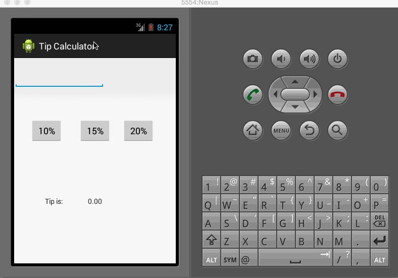

This is a simple Tip calculator App. The functionanity it covers are:
   - Entering the total amount.
   - User should be able to click on 10%, 15% and 20% button to calculate the tip amount.
   - After clicking the tip percentage the tip amount should be displayed.

NOTE:
It allows only integer and double values.

For demo I have created a GIF file.

